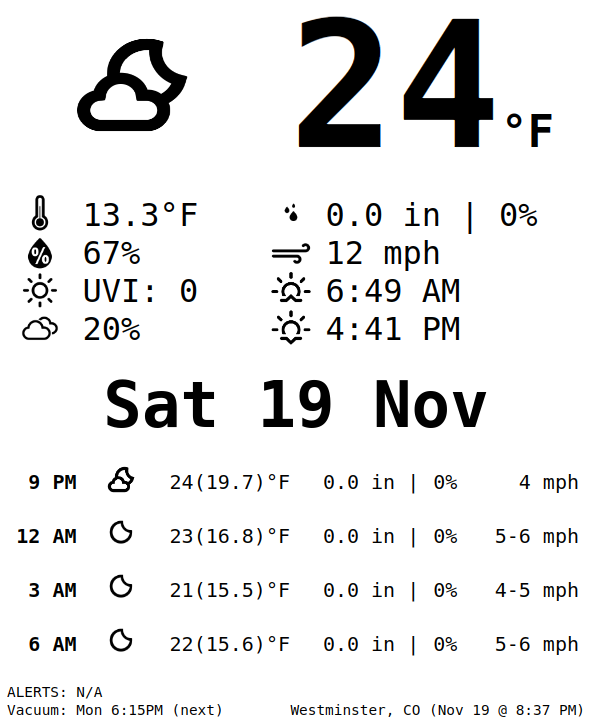

# Raspberry Pi Terminal Hub

Turning a RPi into a server hub using Raspian OS Lite.

Credits: Icons created by [@erikflowers](https://github.com/erikflowers/weather-icons)

The `main.go` file contains the primary logic of continuously running the code. It handles starting and stopping the various underlying services.

**NOTE: PWM usage requires root privleges**

## Configuration

- `--owm`: For passing in the OpenWeatherMap api key. This can also be passed via an `OWM` environment variable
- Configuration of variables in the code can be done via `-ldflags`
```bash
go run -ldflags "-X github.com/aalu1418/rpi-terminal-hub/types.WEATHER_LOCATION=hello" main.go
```
- build + upload to RPi commands (using SSH)
```bash
env GOOS=linux GOARCH=arm GOARM=5 go build
scp rpi-terminal-hub pi@<rpi-ip>:/home/pi/
```

## Modules

Various integrations for controlling / reporting devices and information.

### [service] Web Server

The web server module provides an user facing endpoint for the weather panel, controlling the vacuum, and prometheus metrics host.

- `GET /`: Main endpoint with a stylized HTML page for weather
- `POST /vacuum`: Used for triggering the IR emitter to issue vacuum commands (`start`, `stop`, `30min`, `home`)
```bash
curl -X POST -d "start" localhost:5000/vacuum
```
- `GET /metrics`: prometheus metrics endpoint

### [service] Weather

The weather service polls the OpenWeatherMap API for weather data and provides it in a consumable form to the Web Server.

Learn more here: https://openweathermap.org/api

### [service] Vacuum

Uses the IR emitter to control the robotic vacuum and issue commands on a set schedule.

Original inspiration (actual circuit is slightly different): https://www.hackster.io/austin-stanton/creating-a-raspberry-pi-universal-remote-with-lirc-2fd581

### [service] Alerts

Polling and parsing various endpoints to monitor for alerts. Currently supported:

- [NOAA/NWS](https://www.weather.gov/documentation/services-web-api) weather alerts for given LAT/LON

### [service] Connectivity

Polling a DNS service to determine internet connectivity. Information is reported to the metrics service.

### [service] Metrics

Handles various incoming messages from other services and tracks accordingly using prometheus metrics.

Exporting to Grafana: https://grafana.com/oss/prometheus/exporters/node-exporter/

### [service] Post Office

Message router for the various services to communicate.

### [service] Base

Underlying service that provides base functionality for each services incoming and outgoing messages, frequency of processing, etc.

### [GPIO] Infrared

Provides basic utilities for recording and emitting IR PWM signals

- `--emit-ir`: flag for testing an IR signal
- `--record-ir`: flag for recording an IR signal, prints out golang formatted time durations

## Notes

Setting up SSH on RPi

- https://www.tomshardware.com/reviews/raspberry-pi-headless-setup-how-to,6028.html

Autorun on RPi using CRON

- https://phoenixnap.com/kb/crontab-reboot
- Included a delay to allow internet connection to be established

```
@reboot sleep 15 && sudo /home/pi/rpi-terminal-hub --owm=<API_KEY> >> ~/cron.log 2>&1
```

RPi Timezones

- https://raspberrypi.stackexchange.com/questions/87164/setting-timezone-non-interactively

Server Inspiration

- https://shkspr.mobi/blog/2020/02/turn-an-old-ereader-into-an-information-screen-nook-str/
- completed look: 

